# 会用顶级 AI 的人，效率能高到什么程度？

> 一个 Coding Agent 实践者的四象限框架

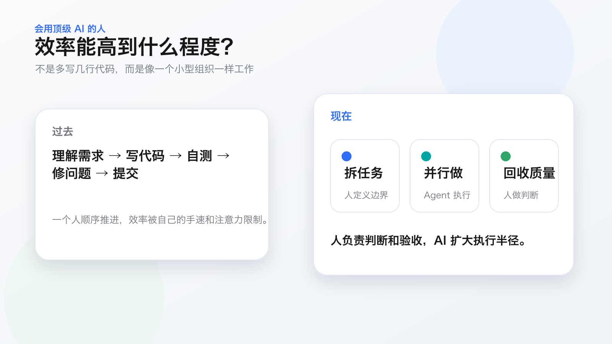

过去一年，社区里关于 Coding Agent 的文章越来越多。

有人讲 Prompt 怎么写，有人讲怎么让 AI 改一个页面，有人讲怎么生成测试、补文档、修 bug。这些当然有价值，但在我看来，大多数实践还停留在一个阶段：

> 把 AI 当成一个更快的程序员。

而我现在更关心的问题是：

> 如果一个人真的会用顶级 AI，他的效率边界会被推到什么程度？

我的答案不是某个神奇工具，也不是某条万能 Prompt，而是一套任务分型方法。

我会先把 Coding 任务按两个维度拆开：

- 重要程度
- 执行复杂度

这两个维度组合起来，就得到一个 Coding Agent 的掌控四象限。

## 先看总图：不是所有任务都该用同一种 AI 协作方式

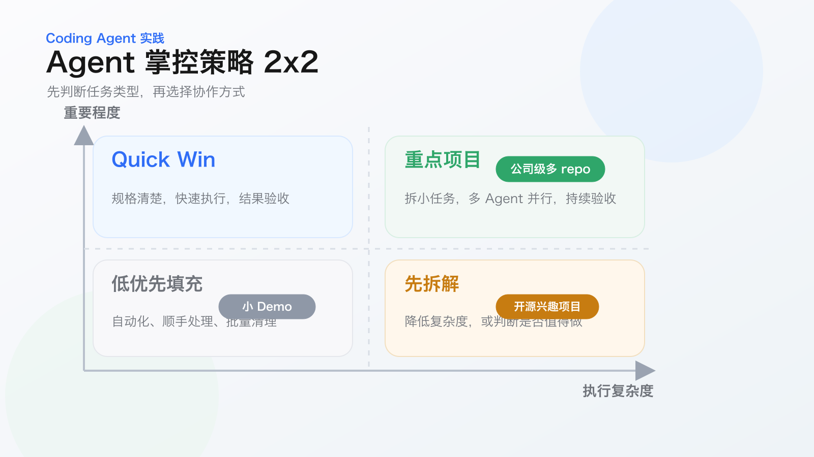

这张图不是为了判断“哪个任务更高级”，而是为了回答一个更关键的问题：

> 这个任务应该用什么方式掌控 Agent？

同样是让 AI 写代码，不同象限里的协作方式完全不同。

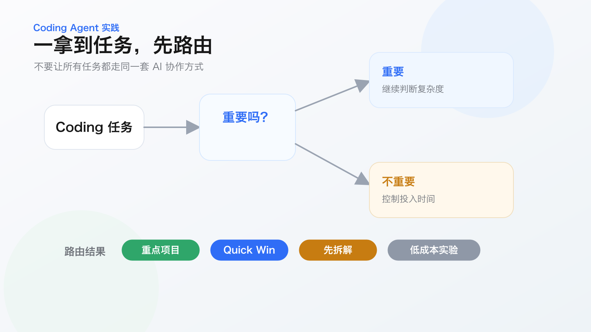

真正的效率提升，不是“让 AI 多写代码”，而是：

> 先判断任务类型，再选择对应的协作方式。

## 为什么普通的 AI 编程实践不够

很多人用 Coding Agent 的方式是这样的：

> 我有一个需求，丢给 AI；AI 写完代码，人看结果；能用就提交，不能用就继续让它改。

这种方式在小任务上没有问题。

但一旦任务进入公司项目、跨仓库项目、长期维护项目，它就会开始失控。因为 Agent 不天然知道什么重要，不天然理解业务边界，也不天然知道某个改动会影响哪些长期演进。

所以我的实践方式变成了另一种：

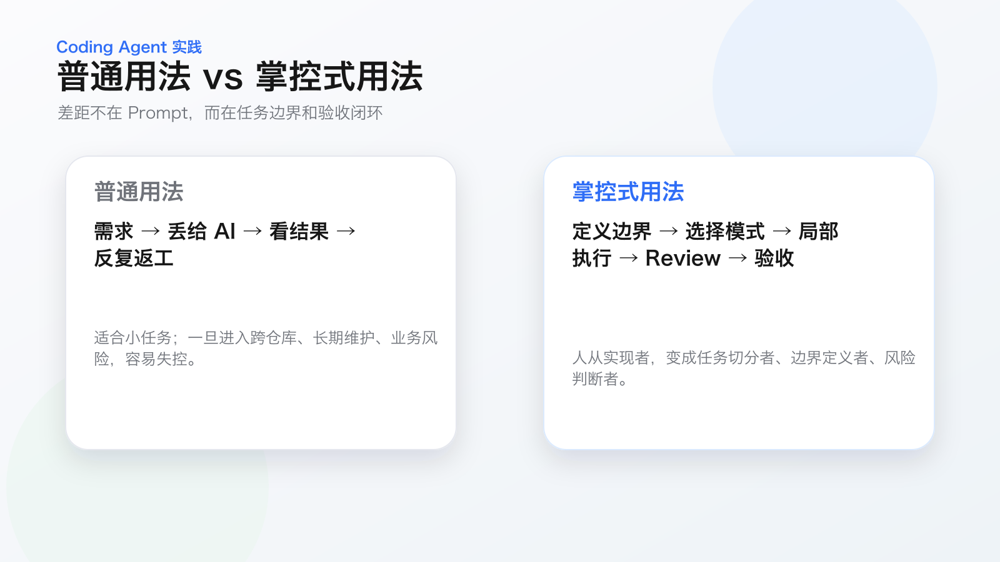

人不是消失了，而是位置变了。

过去人是实现者。现在更像是：

- 任务切分者
- 边界定义者
- 风险判断者
- 结果验收者

## 第一类：公司级重点项目

公司级项目通常落在右上角：

> 高重要程度，高执行复杂度。

这类项目不能靠“你帮我实现一下”解决。它需要人先把边界拆清楚，再让 Agent 在清晰边界里高速执行。

我负责过一个知识库 Agent 相关项目，涉及多个仓库：

- 知识库本身
- AgentKit
- 富文本输入框
- 笔记编辑器
- 笔记相关模块

过去这类需求推进起来很重，因为一个功能可能穿透多个仓库。现在我的做法是，把相关仓库同时打开，并行使用 Coding Agent。

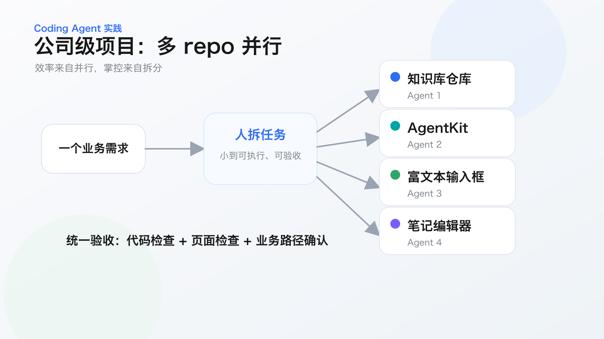

这里最关键的不是“开了几个 Agent”，而是任务必须拆到足够小。

小到什么程度？

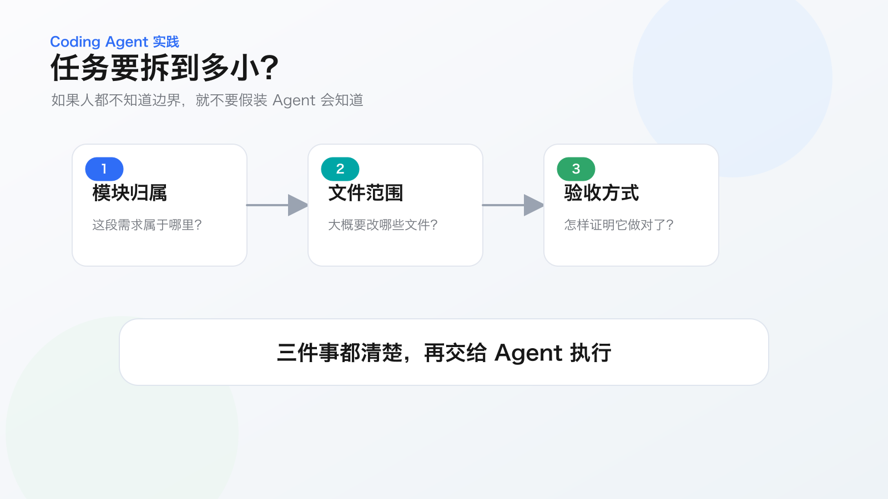

我的标准很直接：

> 如果我自己都不知道边界在哪里，就不要假装 Agent 会知道。

在公司级项目里，效率来自并行，掌控来自拆分。

如果你的项目没有多个仓库，也可以用多个 worktree 做类似的并行开发。重点不是形式，而是把复杂任务拆成多个可验证的局部。

## 第二类：开源兴趣项目

开源兴趣项目通常没有公司项目那么重要，但复杂度并不低。

它可能有产品形态，有竞品，有架构，有前后端，有体验细节。但我不可能像公司项目一样投入大量时间。

所以这类项目的目标不是“无限打磨”，而是：

> 用机制压缩探索成本和验证成本。

我的流程大概是这样：

1. 让 AI 调研竞品和社区方案。
2. 人确定产品框架和架构方向。
3. Agent 实现功能。
4. 用 Code Review、架构 Review、BDD 行为测试回收问题。
5. 人只重点判断风险点和不确定点。

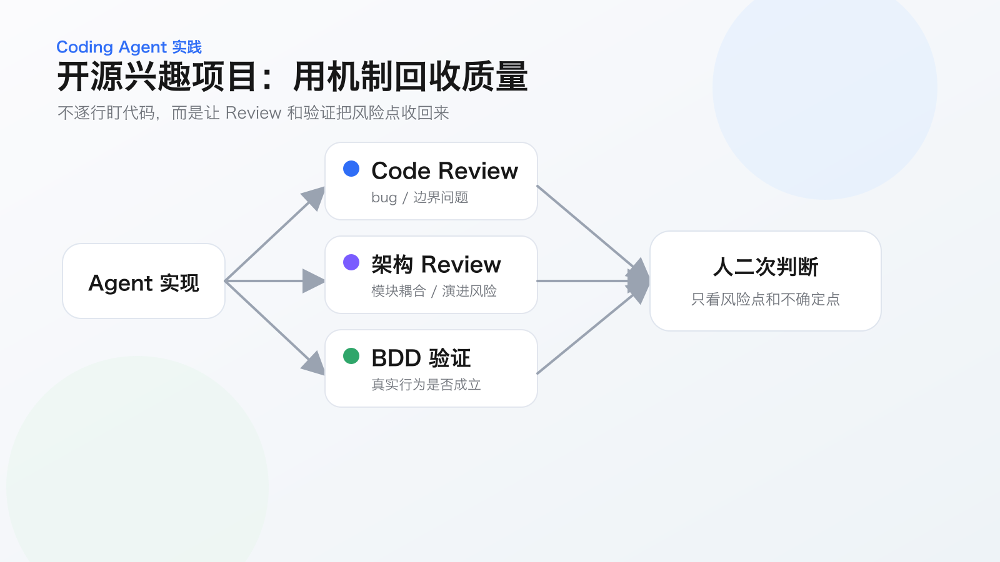

这里的重点是，我不会逐行看 AI 写的所有代码。

Review 不是为了让 AI 审完就直接提交。真正有价值的是它指出的：

- 不确定点
- 风险点
- 设计模糊点
- 行为不一致点

人再去判断这些点是否真实存在，是否值得修，是否影响下一步。

对于后端，BDD 行为测试通常比较直接：围绕 feature 写场景，生成测试脚本，再执行验证。

对于前端，我更看重真实界面和真实交互：启动页面、自动操作关键路径、截图或录屏，再检查布局和交互是否符合预期。

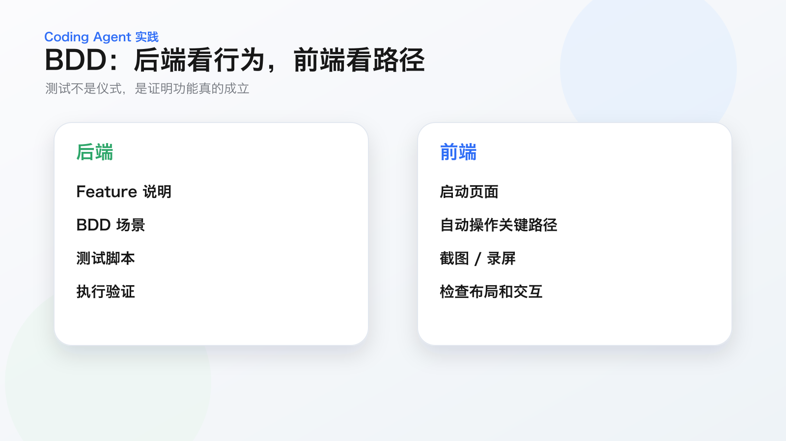

这类项目的关键不是把 AI 当外包，而是建立一套质量回收机制。

## 第三类：小产品、小 Demo、小玩具

还有一类任务，不重要，也不复杂。

比如和朋友一起做一个小产品、小工具、小 Demo。它的目标不是长期维护，而是快速把想法变成可体验的东西。

这类任务最适合两种方式：

- SpaceKit / SpecKit 式开发
- vibe coding 式开发

SpaceKit / SpecKit 式开发更像是：先和 AI 把想法聊清楚，沉淀需求、规范和任务，再让 Agent 按规格实现。人不盯过程，只验收最终体验。

vibe coding 更随意：想到一个点子，直接说给 AI；AI 改页面、改交互；人体验一下，再决定要不要继续改。

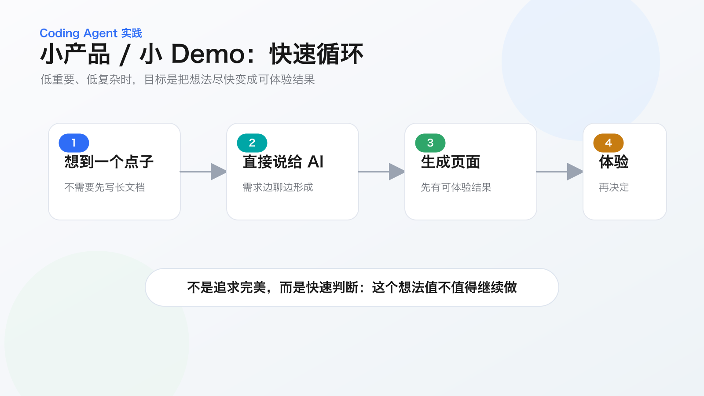

这类任务不需要太重的工程化动作。它的价值在于极低成本地把想法变成可体验的东西。

很多过去只会停留在脑子里的念头，现在可以在半小时、一小时内变成一个真实页面。

它未必完美，但它已经足够让你判断：

> 这个想法有没有继续做的价值？

## 三套实践方式，对应三种掌控模型

把上面三类放在一起，会得到这样一张图：

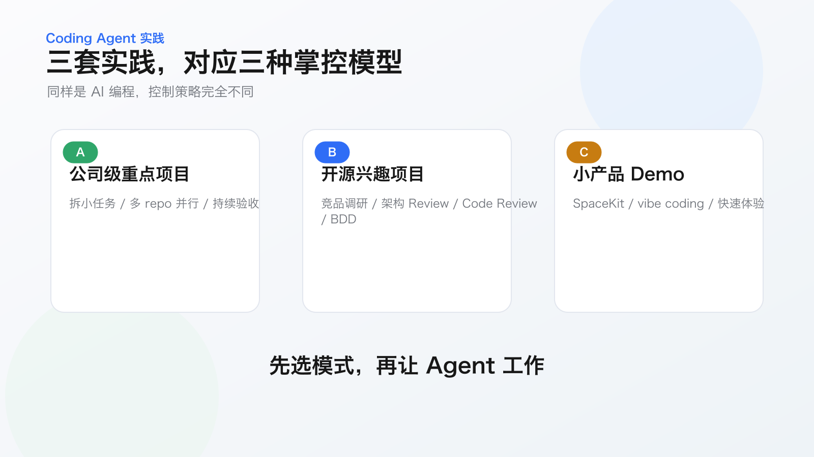

也可以换一个角度看：

- 重要且复杂：人负责拆分和验收，AI 负责并行执行。
- 不重要但复杂：人负责方向，AI 负责调研、实现、Review 和验证。
- 不重要且不复杂：人负责想法，AI 负责快速变成可体验结果。
- 重要但不复杂：人负责规格，AI 负责快速交付。

## 会用 AI 以后，人到底变强在哪里？

表面上看，AI 提升的是写代码速度。

但我真正感受到的变化不是写代码更快，而是自己的工作方式被重构了。

过去一个人只能顺序推进：

> 理解需求 → 写代码 → 自测 → 修问题 → 提交。

现在可以变成：

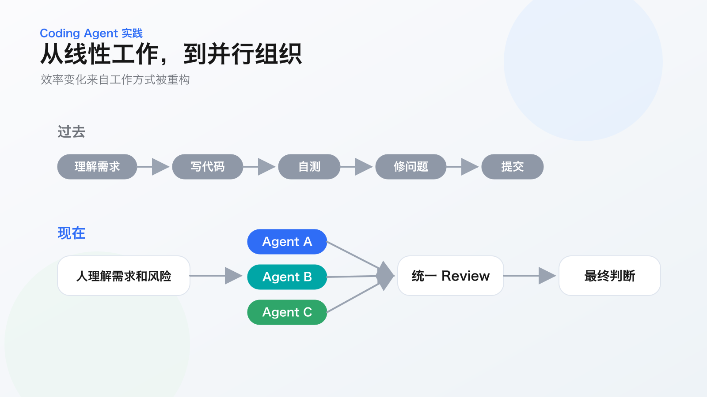

这不是简单快 30%、50%，甚至不是快一倍。

真正的变化是：

> 你能同时推进更多层次的事情。

公司复杂项目里，你用 AI 扩大执行半径。

个人开源项目里，你用 AI 压缩探索成本。

小产品和 Demo 里，你用 AI 释放想法密度。

## 最后：AI 的边界，决定人的新能力

AI 能写代码，但它不天然知道什么重要。

AI 能拆任务，但它不天然理解你的业务风险。

AI 能做 Review，但它不天然拥有最终判断权。

所以会用顶级 AI 的人，真正强的不是会写某条 Prompt，而是具备一组新的工作能力：

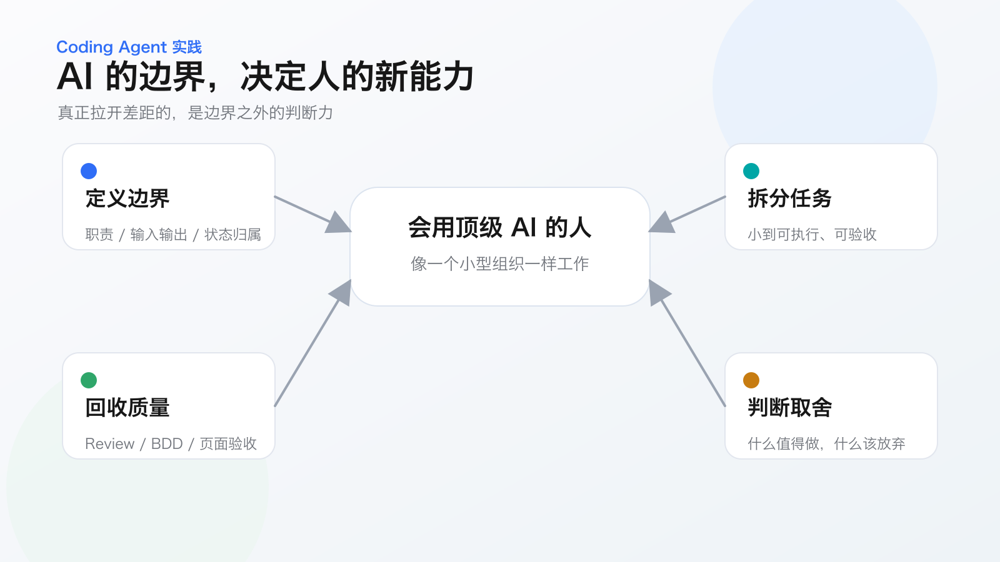

任意一种和 AI 协作的方式，都会提高效率。

但真正拉开差距的，是你能不能持续和它融合，持续找到它的边界，然后把自己训练成那个能驾驭边界的人。

这才是我理解的答案：

> 会用顶级 AI 的人，效率高，不是因为他把自己变成了十个程序员。
>
> 而是因为他开始像一个小型组织一样工作。
